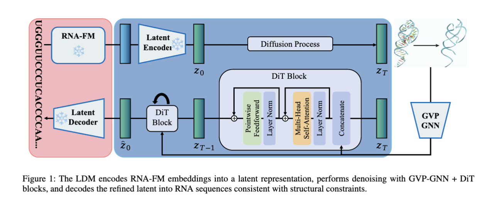
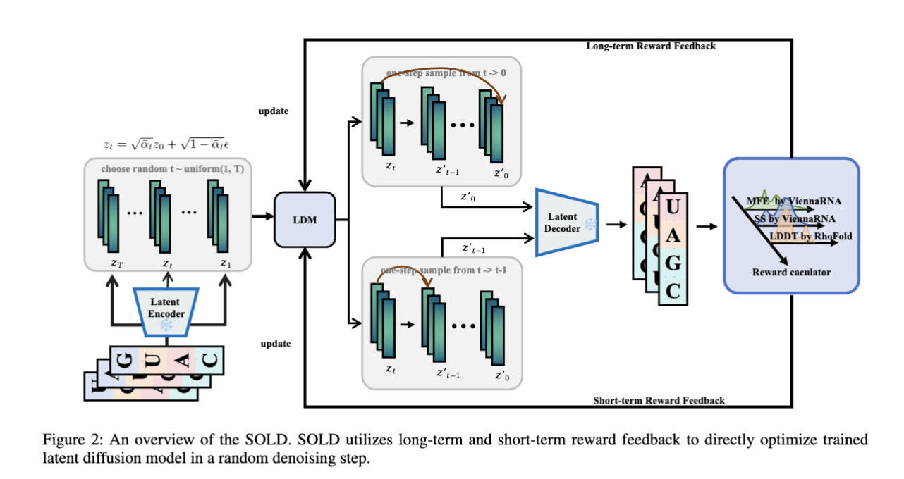

# SOLD: Structure-based RNA Design by Step-wise Optimization of Latent Diffusion Model

[](https://aaai.org/)
[](LICENSE)
[](https://www.python.org/)

This is the official PyTorch implementation of the paper "Structure-based RNA Design by Step-wise Optimization of Latent Diffusion Model", accepted at AAAI 2026.

## 📖 Abstract

SOLD (Step-wise Optimization of Latent Diffusion Model) is a novel framework for RNA inverse folding, designing RNA sequences that fold into specific 3D structures.

While current diffusion methods excel at capturing sequence-structure interactions, they often struggle with non-differentiable objectives like Secondary Structure (SS) consistency and Minimum Free Energy (MFE). SOLD addresses this by:
1.  Latent Diffusion: Using pre-trained RNA-FM embeddings to capture co-evolutionary patterns and compressing them into a latent space.
2.  Step-wise RL Optimization: A reinforcement learning framework that optimizes single-step noise removal without sampling the full trajectory, allowing for efficient optimization of complex structural metrics.

## 📖SOLD Framework
<p align="center">
  
</p>

<p align="center">
  
</p>

## 📖 Data Preparation
The training assumes a CSV format pointing to processed RNA structure data (PDBs).

Source Data: Place your PDB files in a directory (e.g., data/rl_pdbs).

Metadata: Prepare CSV files (train_data.csv, valid_data.csv, test_data.csv) containing metadata and paths to the PDBs.

Important: Update the pdb_data_dir and *_data_path entries in the .yaml configuration files to point to your local directories.


##  🚀 Usage
Stage 1: Encoder-Decoder Pre-training
First, we train the MLP encoder/decoder to compress the high-dimensional RNA-FM embeddings into a latent representation.
Modify encoder_decoder.yaml to set your data paths and output directory.

Run the training script:
```bash
python train_encoder_decoder.py --config configs/encoder_decoder.yaml
```

Output: Checkpoints will be saved to results/sold_encoder_decoder/.... Note the path of the best checkpoint (e.g., model_separate_epoch_XX.pt) for the next step.

Stage 2: Latent Diffusion Training
Next, we train the Latent Diffusion Model (LDM) to generate the latent representations conditioned on the structure.

Open latent_diffusion.yaml.
Crucial: Update encoder_decoder_config.ckpt_path and latent_compressed.model_path with the checkpoint path obtained from Stage 1.

Run the training script:
```bash
python train_latent_diffusion.py --config configs/latent_diffusion.yaml
```
Output: Checkpoints will be saved to results/sold_uniform_step_abalation/.... Note the path of the best checkpoint for the RL stage.


Stage 3: RL Fine-tuning (SOLD)
Finally, we apply the Step-wise Optimization of Latent Diffusion (SOLD) algorithm to fine-tune the model against specific structural metrics.

Open rl_finetune.yaml.

Crucial: Update train_config.ckpt_path with the LDM checkpoint from Stage 2.

Ensure latent_compressed.model_path points to the Stage 1 checkpoint.

Configure your rewards in rl_config:

```bash
rl_config:
  name: sold
  ss_weight: 1.0   # Secondary Structure Reward
  mfe_weight: 1.0  # Minimum Free Energy Reward
  lddt_weight: 0.0 # LDDT Reward (requires RhoFold)
  recovery_weight: 0.0
```

Run the fine-tuning:
```bash
python train_rl_finetune.py --config configs/rl_finetune.yaml
```

## 🔧 Configuration
The system is controlled via YAML files. Here are key parameters to adjust:

Parameter,Description
model_config.latent_out_dim,Dimension of the latent space (must match encoder).
train_config.latent_transition_config.num_steps,Number of diffusion timesteps (T).

Parameter,Description
```
rl_config.name,"Algorithm to use (sold, ddpo, dpok)."
rl_config.*_weight,"Weights for different reward objectives (MFE, SS, LDDT)."
train_config.max_train_epochs,Number of RL epochs.
train_config.batch_size,Training batch size.
```


## 📜 Citation
If you use this code or the SOLD framework in your research, please cite our paper:
```bibtex
@article{si2026structure,
  title={Structure-based RNA Design by Step-wise Optimization of Latent Diffusion Model},
  author={Qi Si and Xuyang Liu and Penglei Wang and Xin Guo and Yuan Qi and Yuan Cheng},
  journal={arXiv preprint arXiv:2601.19232},
  year={2024}
}
```

